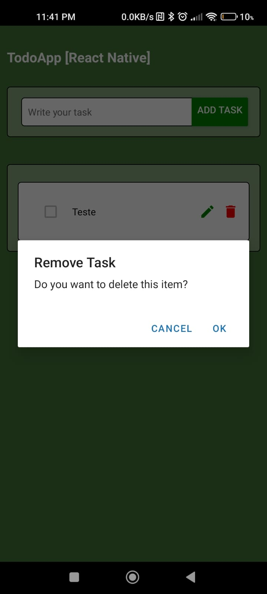
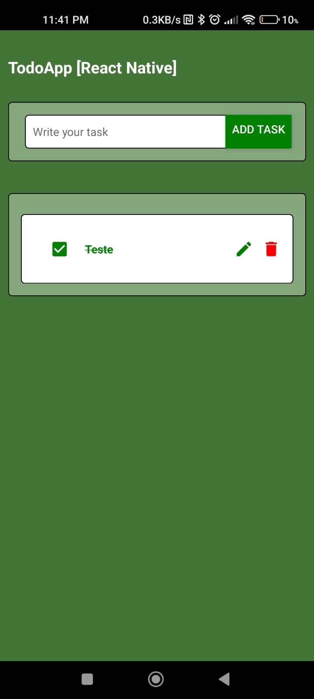
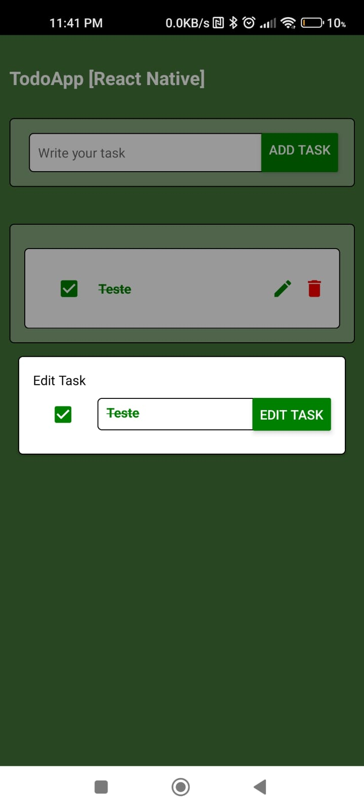

<div align="center">


</div>

<br>
<br>

<p align="center"> 
  
     
  <a href="https://github.com/Joaovitorsw">
    
  </a>  
   
   

</p>

# Todo App

## Environment

- React Version: 18.2.0
- React Native Version: 0.71.7
- Node Version: 14(LTS)

## [Change]: Project Specifications

## Application Demo:

| First Preview                                    | Second Preview                                   | Third Preview                                    |
| ------------------------------------------------ | ------------------------------------------------ | ------------------------------------------------ |
|  |  |  |

**Commands**

- run:

```bash
npm start
```

- install:

```bash
npm install
```
